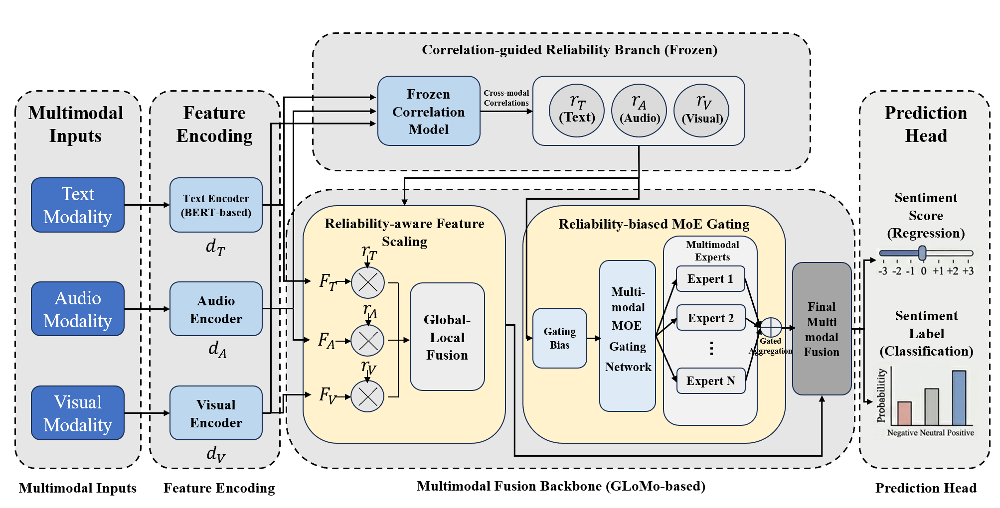

# Correlation-Guided Reliability Modeling for Robust Multimodal Sentiment Analysis

This repository contains the code for the paper **"Correlation-Guided Reliability Modeling for Robust Multimodal Sentiment Analysis"**.

The current public codebase focuses on the main sentiment analysis experiments on **CMU-MOSI** and **CMU-MOSEI**, together with correlation pretraining, archived experiment records, and figure-generation scripts.

## Framework



## Repository Structure

- `Correlation_Guided_MSA/`
  - Main training and evaluation code for CMU-MOSI and CMU-MOSEI.
- `Correlation_Pretraining/`
  - Correlation pretraining utilities and related components.
- `figure_scripts/`
  - Scripts used to generate paper figures.
- `experiments/`
  - Archived experiment records for reproducibility.
- `datasets/`
  - Local dataset files expected by the training scripts.

## Installation

Create a Python environment and install the required packages:

```bash
pip install -r requirements.txt
```

If your environment installs PyTorch separately, adjust the installation order as needed for your platform.

## Data Preparation

Place the required dataset files under `datasets/`.

Expected files for the main paper experiments:

- `datasets/mosi.pkl`
- `datasets/mosei.pkl`

## Main Training Entry Point

The main sentiment analysis entry point is:

- `Correlation_Guided_MSA/main_cgmsa.py`

Typical workflow:

1. prepare dataset files under `datasets/`
2. optionally pretrain correlation modules
3. run baseline and proposed-model experiments
4. generate figures from archived experiment outputs

## Example Commands

### MOSI Baseline

```bash
cd Correlation_Guided_MSA
python main_cgmsa.py \
  --dataset mosi \
  --max_seq_length 60 \
  --train_batch_size 240 \
  --d_l 48 \
  --layers 4 \
  --VISUAL_DIM 47 \
  --learning_rate 4e-5 \
  --n_epochs 70 \
  --save_best_by acc2
```

### MOSI Ours

```bash
cd Correlation_Guided_MSA
python main_cgmsa.py \
  --dataset mosi \
  --max_seq_length 60 \
  --train_batch_size 240 \
  --d_l 48 \
  --layers 4 \
  --VISUAL_DIM 47 \
  --learning_rate 4e-5 \
  --n_epochs 70 \
  --use_fusion_correlation \
  --corr_model_path /path/to/correlation_checkpoint.pt \
  --corr_alpha 0.2 \
  --use_moe_reliability \
  --moe_reliability_lambda 0.05 \
  --save_best_by acc2
```

### MOSEI Baseline

```bash
cd Correlation_Guided_MSA
python main_cgmsa.py \
  --dataset mosei \
  --max_seq_length 80 \
  --train_batch_size 64 \
  --d_l 192 \
  --layers 3 \
  --VISUAL_DIM 35 \
  --learning_rate 1e-5 \
  --n_epochs 100 \
  --save_best_by acc2
```

### MOSEI Ours

```bash
cd Correlation_Guided_MSA
python main_cgmsa.py \
  --dataset mosei \
  --max_seq_length 80 \
  --train_batch_size 64 \
  --d_l 192 \
  --layers 3 \
  --VISUAL_DIM 35 \
  --learning_rate 1e-5 \
  --n_epochs 100 \
  --use_fusion_correlation \
  --corr_model_path /path/to/correlation_checkpoint.pt \
  --corr_alpha 0.2 \
  --use_moe_reliability \
  --moe_reliability_lambda 0.1 \
  --save_best_by acc2
```

Additional ablation and extension runs are archived under `experiments/`.

## Correlation Pretraining

The correlation pretraining entry point is:

- `Correlation_Pretraining/modality_correlation/main_correlation_glomo.py`

Example:

```bash
cd Correlation_Pretraining/modality_correlation
python main_correlation_glomo.py --dataset mosi --build_cache
```

Pretrained checkpoints used by the main model are expected to be provided locally and referenced through `--corr_model_path`.

## Figure Generation

Paper figures are generated from `figure_scripts/`.

Example:

```bash
cd figure_scripts
bash generate_all_figures.sh
```

Selected figure scripts read archived analysis outputs from the corresponding experiment directories under `experiments/`.

## Reproducibility

This repository is organized to support reproducibility:

- each reported result corresponds to an archived experiment record
- each table corresponds to a reproducible experiment group
- each figure corresponds to a dedicated generation script

Archived experiment records may contain:

- `command.sh`
- `train.log`
- `metrics.json`
- selected analysis outputs required for figure generation

Historical experiment records are preserved as originally produced. Some archived files may therefore contain local absolute paths or earlier script names from the original training environment. These are intentionally kept for traceability.

## Notes

- Large checkpoints and many intermediate artifacts are not tracked in full.
- Only selected analysis files required by the paper figures are included in version control.
- The manuscript PDF is managed separately from the tracked code submission.

## License

See `LICENSE` for repository licensing terms. Review any third-party component licenses before redistributing derived assets, datasets, or checkpoints.
